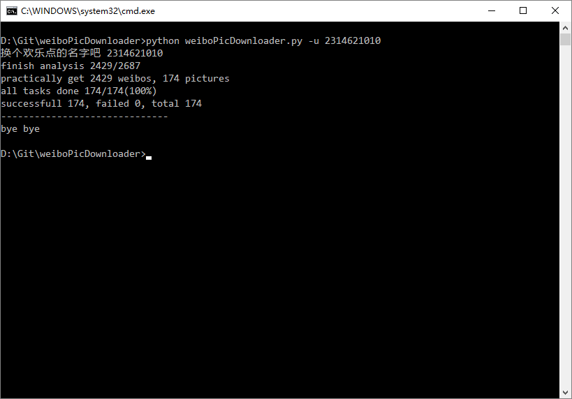

# 免登录下载微博图片

批量下载微博用户图片(CLI)

根源自Java项目 [yAnXImIN/weiboPicDownloader](https://github.com/yAnXImIN/weiboPicDownloader)  

也从另一移植项目学到了好多 [ningshu/weiboPicDownloader](https://github.com/ningshu/weiboPicDownloader) 

非常感谢两位巨巨

## 描述

应 issue [#2](https://github.com/nondanee/weiboPicDownloader/issues/2) [#3](https://github.com/nondanee/weiboPicDownloader/issues/3) 的要求，现已支持真·批量下载

可以带参数运行，也可以从文件导入

基本重写了代码，简化了大量的交互，删除了大量输入检查

考虑到纯命令的方式可能对普通用户不太友好，所以新建一个分支

如果没有批量需求，用原来的版本也行

新版本同样兼容Python2和Python3

## 预览



## 使用

```
$ python .\weiboPicDownloader.py -h
usage: weiboPicDownloader [-h] [-u user] [-us users [users ...]] [-f file]
                          [-d directory] [-s size] [-v] [-o]

optional arguments:
  -h, --help            show this help message and exit
  -u user               target a weibo user's nickname or id
  -us users [users ...]
                        target weibo users' nickname or id
  -f file               export user list from file
  -d directory          set picture saving path
  -s size               set size of thread pool
  -v                    download videos together
  -o                    overwrite existing files
```

必需参数（任选一）

- `-u` 用户（昵称或ID）
- `-us` 多个用户（昵称或ID，用空格分隔）
- `-f` 用户列表文件（昵称或ID，用换行分隔）

可选参数

- `-d` 图片保存路径（默认为工作路径下的weiboPic目录）
- `-s` 线程池大小（默认为20）
- `-v` 同时下载秒拍视频
- `-o` 重新下载已保存的文件（默认跳过）

